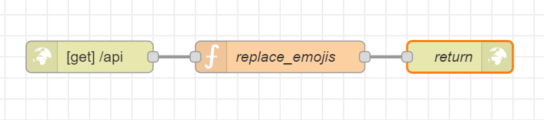

# API mit nodeRED erstellen

## Anleitung
Um eine simple API auf nodRED zu erstellen, mussn als ersten eine neue http in node erstellt werden. In der http in node kann dann die URL definiert werden, unter der die API erreichbar ist. Zum beispiel `/api`.

Danach kann ein Skript angefügt werden, wo die Daten verarbeitet werden. Was mit den empfangenen Daten angefangen wird, ist frei wählbar. Zur Demonstration kann ein Skript angefügt werden, welches nur die Zeile `retunr msg;` enthält. Dieses Skript leitet einfach die empfangenen Daten weiter.

Als letzes wird eine http response node angefügt, welche auf die Anfrage mit den Datenm, welches das Skript ausgiebt, antwortet. In unserem beispiel mit dem `return msg;` Skript werden also einfach die Daten, welche wir an die API gesendet haben, wieder zurückgesendet.

Hier eine Visualisierung der simplen API in NodeRED:

## Erklärung
Unsere API kommuniziert via HTTP. Der Client sendet eine Anfrage an die API-Endpunkt-URL. Die Anfrage kann verschiedene Arten von Informationen enthalten, wie z.B. eine Anfrage-Methode wie `GET`, `POST`, `PUT` oder `DELETE`, Parameter, Header-Informationen und manchmal auch einen Anfrage-Body, der Daten enthält, die an die API gesendet werden sollen.

Die API empfängt die Anfrage und verarbeitet sie, indem sie die notwendigen Daten aus der Anfrage extrahiert, in unserem Fall die Daten manipuliert, um eine Antwort zu generieren. Die Antwort wird dann als HTTP-Antwort zurück an den Client gesendet, die in der Regel einen Statuscode, Header-Informationen und manchmal auch einen Antwort-Body enthält, der die Daten enthält, die an den Client zurückgesendet werden.

## Erfahrungen 
Meine Erfahrungen mit dem Erstellen einer eigenen API mit NodeRED waren durchaus positiv. Das Erstellen geschieht durch die simple Natur von NodeRED mit grosser Mühelosigkeit. Trotzdem denke ich, dass mit NodeRED ganz schön nützliche und vielleicht sogar mächtige APIs erstellt werden können.