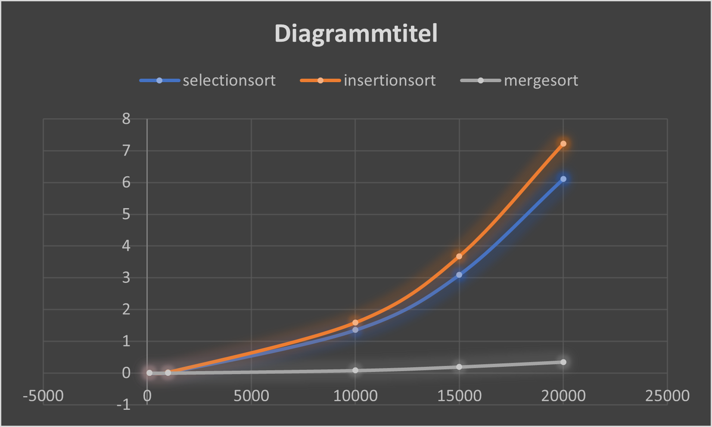

Die Unterschiedlichen Algorithmen hatten stark unterschiedliche Laufzeiten.

Messungen:

Es ist zu sehen, dass MergeSort eine massiv bessere Laufzeitentwicklung hat als Selection- und Insertion sort.

